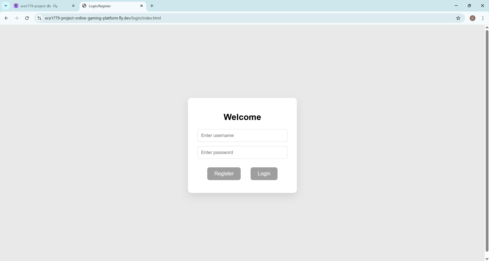
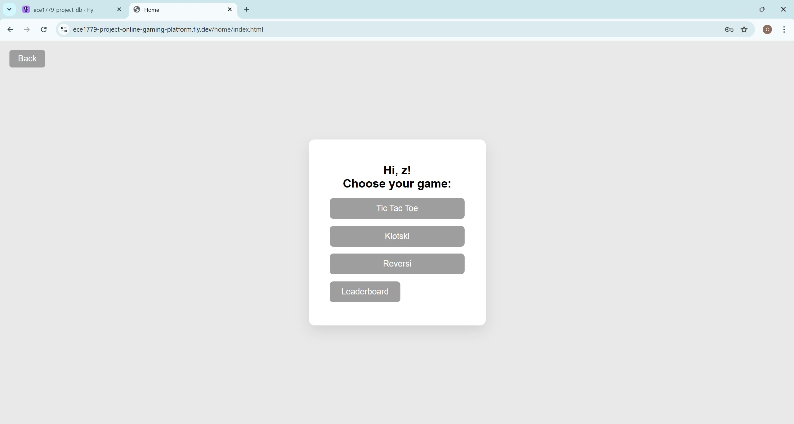
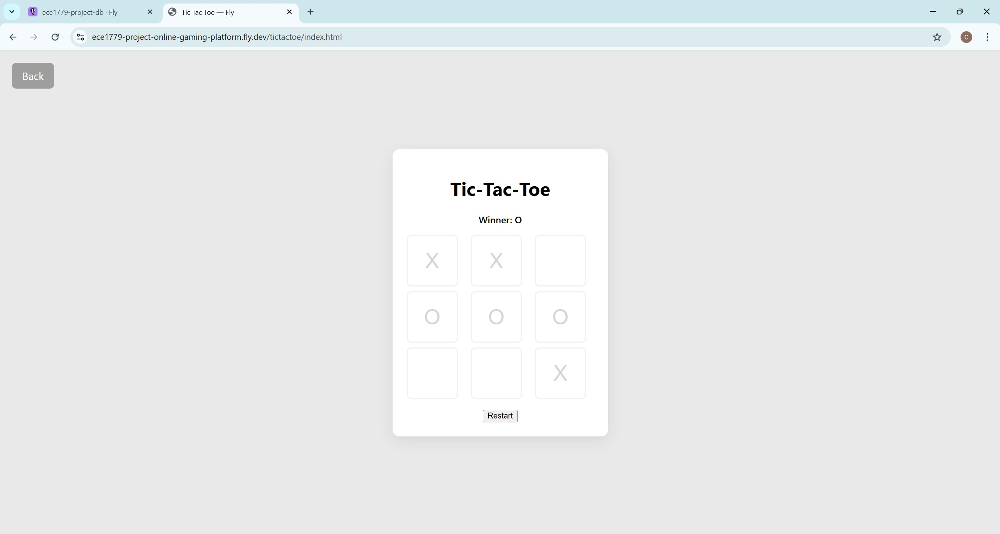
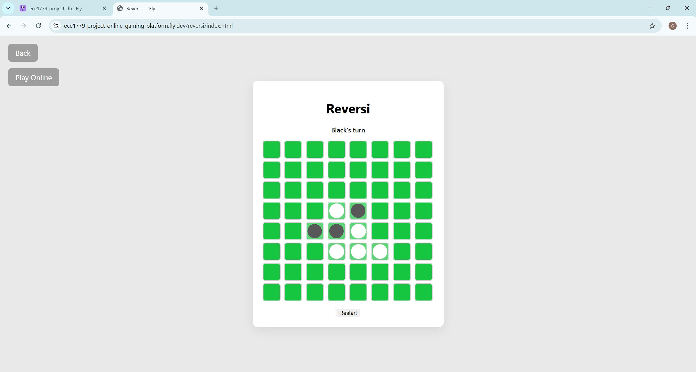
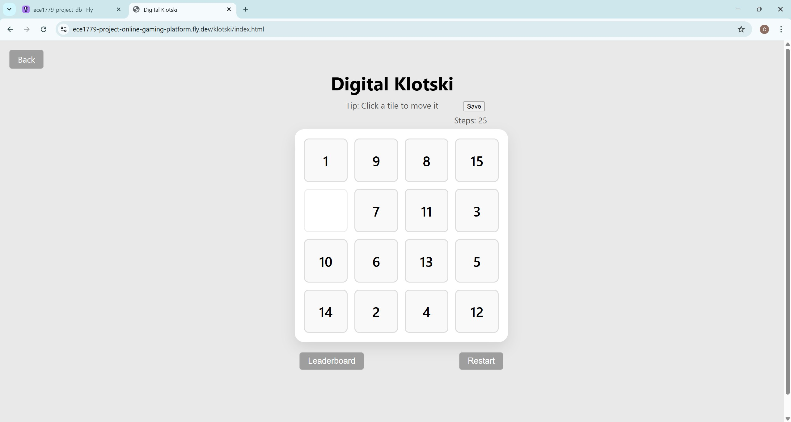
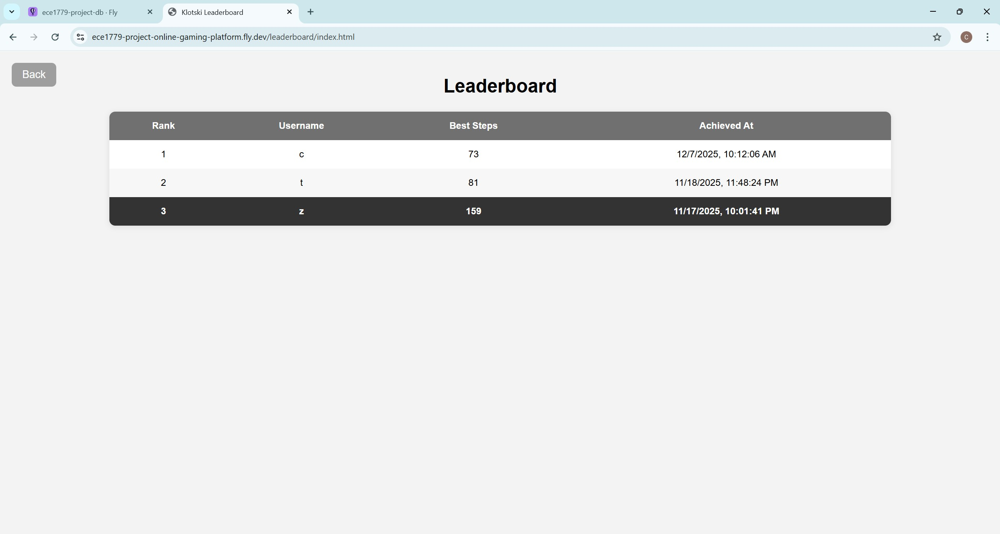

# ECE1779 Project
## Team Information
Zhiqi(Charles) Yu 1006718358
charlesyuzq.yu@mail.utoronto.ca

Yuchen Zoe 1006708779
yuchenzoe.xu@mail.utoronto.ca


## Motivation
### Background
Web-based games have long been a popular form of entertainment as they are easy to access, simple to play, and compatible with most devices. Their straightforward structure also makes them valuable for studying how interactive applications manage state and handle user actions in real time. 
Problem Statement and Need:
This project addresses the need for stable, continuous, and maintainable online games, while avoiding heavy system requirements or complex setups. Many existing gaming platforms focus on high-end graphics or large downloads, excluding users who prefer quick, browser-based experiences. To fill the gap, this project aims to develop a lightweight online gaming platform, which supports instant games, using cloud-based technologies online.
### Project Value
This project is worth pursuing as it offers a practical foundation for learning and applying modern web technologies such as cloud deployment, database integration, and real-time networking—skills valuable in current software development trends.
### Target Users
The target users include casual gamers, students learning web development, and individuals seeking quick entertainment through simple, device-independent gameplay. 
### Existing Products and Limitations
Our motivation for this project comes from several key observations about the limitations of existing online game systems and the potential benefits of cloud technologies. 
1. **Lack of Persistent State Management**

One major limitation of current online game systems is the lack of persistent state management. Game state such as game progress, scores, or user interactions are often stored temporarily only in memory or in local files, as most web games still rely on short-lived servers without external persistence [1]. This not only prevents players from resuming their games or reviewing their past sessions but also limits developers’ capability to analyze gameplay data. In contrast, a cloud-native architecture solves this by integrating persistent database storage. By using PostgreSQL with persistent volumes, game data can be restored under page refresh or system restart/upgrade, and are consistently available for future analysis, ensuring both stability and continuity for users. 

2. **Lack of Observability and Deployment Flexibility**

Another problem is the lack of observability and deployment flexibility in traditional online game platforms. Specifically, many small online games are deployed manually on a single server without automated monitoring or orchestration. This limitation, as noted in industry analyses, arises because traditional monitoring tools offer only limited visibility into system behavior and user experience [2]. When the service experiences performance issues or crashes, developers have limited visibility into resource usage or system health, making the maintenance of the system inefficient and error-prone. Conversely, a cloud-native approach can effectively address these challenges by using containerization and orchestration tools such as Docker Swarm and Fly.io Metrics to standardize deployment and collect runtime metrics. This allows developers to monitor system performance in real time and maintain consistent reliability across all environments.
### Conclusion
To address these challenges and evaluate the potential of cloud-native technologies, this project aims to develop a cloud-native online game platform that leverages cloud technologies to manage game states, persist user data, and analyze performance metrics across sessions. Ultimately, it seeks to explore how cloud-based architecture can enhance the stability, continuity, and maintainability of online gaming platforms.

## Objectives
The objective of this project is to develop a cloud-native gaming platform supporting single-player, offline multiplayer, and online multiplayer modes. A few games are currently supported, and the platform is very flexible for expansion of more games.  

We would like users to be able to register with their own accounts, retrieve their game status when they log in, and compete with other players through live leaderboards or direct online matches. 
 
### Current Games Supported:
- Single Player: Digital Klotski, Tic Tac Toe, Reverse Chess.  
- Multiplayer Offline: Tic Tac Toe, Reverse Chess, on a single computer.  
- Multiplayer Online: Tic Tac Toe, Reverse Chess, for players across the internet.

## Technical Stack - (5 Core + 3 Advanced)
### Local Development (Core):
- Docker was used for local testing and development
- Docker Compose was used to containerize the application. Two separate containers were used, one for the app and one for the database.
- An additional VSCode live server extension was also used to help with local testing, allowing static pages and dynamic server actions to be tested in local browsers. 

### Orchestration (Core):
- Docker Swarm Mode was used to manage containerized and multi-host services, providing scalability and fault tolerance. Hosts were used for database, backend game logics, frontend displays, etc.  
  - The expected product application is relatively small, so Docker Swarm Mode was chosen for its light weight and flexibility. Swarm is also tightly integrated with Docker, and that could simplify the development process for small projects.
- Local development was conducted through Docker Compose, for easy testing and deployment. Two containers were implemented, the app and the database.  

### Database and Persistent Storage (Core):
- PostgreSQL was used for game state storage, player profiles, and leaderboards.  
  - Users are able to register, login with usernames and passwords, resume game state in Single Player and Multiplayer Offline modes, and enter a weekly refreshed leaderboard.
- In Docker, persistent volumes were mounted on the db directory.
- On Fly.io, Fly Volumes were applied for persistent storage to ensure data durability.
  - After a restart of the whole system due to potential maintenance or upgrade, players are still able to retrieve their games. 
- Database schema includes tables for users, game sessions, and leaderboards.  
  - e.g. See examples below:
```
-- Users table
CREATE TABLE IF NOT EXISTS users (
    user_id SERIAL PRIMARY KEY,
    username VARCHAR(50) UNIQUE NOT NULL,
    password VARCHAR(255),
    created_at TIMESTAMP DEFAULT CURRENT_TIMESTAMP,
    last_login TIMESTAMP
);
-- Klotski game table
CREATE TABLE IF NOT EXISTS klotski_game (
    user_id INTEGER PRIMARY KEY REFERENCES users(user_id),
    board JSONB NOT NULL,
    current_steps INTEGER NOT NULL,
    updated_at TIMESTAMP DEFAULT CURRENT_TIMESTAMP
);
-- Klotski leaderboard table
CREATE TABLE IF NOT EXISTS klotski_leaderboard (
    user_id INTEGER PRIMARY KEY REFERENCES users(user_id),
    best_steps INTEGER NOT NULL,
    created_at TIMESTAMP DEFAULT CURRENT_TIMESTAMP
);
```

### Deployment Provider (Core):
- Fly.io was chosen for cloud deployment, leveraging global edge locations to reduce latency for online multiplayer games.

The team wants to focus more on application development and less on managing infrastructures, so fly.io is preferred over DigitalOcean as a PaaS platform. Fly.io also has the advantage to deploy applications across regions worldwide (closer to users), and this is very suitable for online gaming.  
 
### Monitoring and Observability – Grafana based (Core):
- Basic metrics:
  - Grafana metrics were set up for CPU, memory, disk usage.
  - Metrics were also set up for general system health issues, such as HTTP high latencies, or resource usage spikes.
- Functional metrics:
  - Customized metrics were set up for user activities, to analyze the platform usage, potentially improve our application. E.g. High registration activity period, high gameplay activity period.
  - Customized event logging was set up for player actions, such as new registrations and new logins.
  - Logs were also set up for alerts in all metrics mentioned above.
 
### Real-Time Functionality (Advanced):  
- WebSocket-based updates are applied for multiplayer online games to ensure smooth and synchronized gameplay.
- Players can compete with others on the Internet for some of the supported games. 
  - Game board is updated in real time.
### CI/CD pipeline (Advanced):
- GitHub actions for CI/CD pipeline was implemented.
- Builds and tests are automatically run for every git push and pull request.
- Automatic deployment to Flyio is done after all tests have passed.
- Manual start option is enabled for all actions.
### Backup and Recovery (Advanced):  
- Monthly snapshots of PostgreSQL database are taken automatically to prevent data loss.
- GitHub action pipeline is set up for this automated process. 
- The data gets stored in AWS S3 storage.

### Backend:
- Node.js
### Frontend
- HTML, Javascript, and CSS


## Application Features and Fulfillment of Course Requirements:

Here is a summary of features which are compliant with course requirements. In total, there are 8 features (5 core features + 3 advanced features) implemented. 

- User registration/login, persistent game status, and live leaderboard:
  - Achieved using PostgreSQL and Fly Volumes.
  - Ensures consistent game experience. 
  - Fulfilled Core Technical Requirement 2: State Management.
- Online matches: users can compete with other players on the internet. 
  - Achieved using WebSocket. 
  - A key feature to make the games fun to play. Fulfills our entertaining purpose. 
  - Fulfilled Advanced Feature Requirement 1: Real-time functionality.
- Automated database backup:
  - Achieved using GitHub Action and AWS S3.
  - Protects users from game data loss or account loss.
  - Fulfilled Advanced Feature Requirement 2: Backup and recovery.
- GitHub Actions for automated builds, tests, deployments, and backups: 
  - Makes the development process efficient. 
  - Fulfilled Advanced Feature Requirement 3: CI/CD pipeline.
- Local testing and development: separate containerization of the app and the database.
  - Makes the app, the database and local testings portable. 
  - Achieved using Docker and Docker Compose, and additionally a VSCode live server extension.
  - Fulfilled Core Technical Requirement 1: Containerization and Local Development.
- Orchestration of multiple replicas:
  - Achieved using Docker Swarm Mode.
  - Enables load distribution, and ensures platform availability to the users.
  - Fulfilled Core Technical Requirement 4: Orchestration Approach.
- App deployment: 
  - Used Fly.io. 
  - Makes the app accessible to users across the Internet. This is another key of cloud computing for online gaming platform. 
  - Fulfilled Core Technical Requirement 3: Deployment Provider
- Metrics and alerts for system health, and event loggings for user activities:
  - Achieved through integrated and customized metrics and logs in Grafana, accessible from both the Grafana user interface and API endpoints from our app.
  - Enhances development process safety for developers.
  - Fulfilled Core Technical Requirement 5: Monitoring and Observability

The application also has a fully functional frontend, and every game has its own game logics implemented. These are all implicitly included in the features mentioned above.

These features deliver a practical gaming experience, and are aligned with the course’s objective for cloud-based application development.


## User Guide
This section describes how users interact with our cloud-based online gaming platform. 
### System Overview
Our platform mainly consists of the following parts:
- User authentication page (used for register & login)
- Multiple games:
  - Tic-Tac-Toe
  - Digital Klotski
  - Reversi
- Online leaderboard system

### User Authentication

On the frontend page, there are two buttons which are used to login or register. During the registration process, the new user is required to input a valid username and password and clicks the register button. These credentials are then sent to the backend through the POST /register API in the request body. Once registration is successful, the user is automatically redirected to the main page.  

For returning users, login is performed by entering a valid username and password and submitting them through the POST /login API. Then the user will be redirected to the main page. All the user data will be stored persistently in the backend database. 

### Games supported
After login, users enter the Home page from which they can access the three games and the leaderboard system.


Tic-tac-toe provides an interactive game board where the users take turns to play locally by clicking on grid cells to place their moves. The system automatically checks and displays game results such as win, loss, or draw in real time. 

When the user selects the Reversi game, the game board is displayed and users can either play in local two-player mode or online multiplayer mode, depending on system configuration. The player can click the play online button to wait for the other player to join in order to play.

Digital Klotski is a puzzle-based game that allows users to move blocks strategically to make all digits in order. 

While playing Digital Klotskim, users are able to save their current game state at any time by clicking the save button on the interface.The frontend sends the user ID, the current board configuration, and the number of steps taken to the backend through the POST /api/klotski/save API in the request body. When the user refreshes the page, or wants to continue the game after relogin, the saved data can be retrieved using the POST /api/klotski/load API. 

###  Leaderboard

The leaderboard feature allows users to view the top 10 best Klotski game scores across the platform. When a user clicks the leaderboard button from the main page or Klotski page, the frontend retrieves the ranking data by calling the GET /api/klotski/leaderboard API. Then, the leaderboard will load each player’s username, best step count, and the time when the record was created. 

Every time a user completes a Digital Klotski game, the result can be submitted to the leaderboard using the POST /api/klotski/leaderboard/save API. The user_id and achieved best_steps will be sent to the backend. The system will compare new results with old rankings and only update the record if the new step count is smaller than the existing one, ensuring that only a user’s best performance is preserved. 

Overall, the system integrates user authentication, real-time gameplay, persistent data storage, and leaderboard ranking into a cloud-based system. Each part is supported by corresponding backend APIs. The system can be accessed from either frontend or backend API calls. 

## Development Guide
Before running the project locally, the following software must be installed: Docker, Docker Compose v2, Node.js. The project contains two main configuration files for container orchestration:
- compose.yaml: used for local development with Docker Compose
- docker-stack.yaml: used for deployment with Docker Swarm
  
There are three services: Backend, Frontend and PostgreSQL database. All services are defined and managed through Docker Containers.

### Project File Structure
The project is mainly seperated as frontend, backend, deployment, and configuration files. The main files and folders are described as follows:
```text
.
├── frontend/                      # Frontend web application source code
│   ├── home/                      # Home page
│   ├── klotski/                   # Digital Klotski game page
│   ├── leaderboard/               # Leaderboard page
│   ├── login/                     # Login and user authentication page
│   ├── reversi/                   # General Reversi game page
│   ├── reversi_online/            # Online multiplayer Reversi game page
│   ├── reversi_single/            # Single-player Reversi game page
│   ├── tictactoe/                 # Tic-Tac-Toe game page
│   └── tictactoe_online/          # Online multiplayer Tic-Tac-Toe game page
│
├── screenshots/                   # Screenshots used for report
│
├── .gitignore                     # Git ignore configuration
├── Dockerfile                     # Docker image build file for backend
├── README.md                      # Project documentation
├── compose.yaml                   # Docker Compose configuration file
├── docker-stack.yaml              # Docker Swarm deployment configuration file
├── init.sql                       # PostgreSQL database initialization script
├── package.json                   # Project configuration and dependencies
└── package-lock.json              # Locked dependencies
```

### Local Development Setup Using Docker Compose
The following are the steps for setting up Docker Compose:
1. Clone the repository: 
```bash
git clone https://github.com/qasxxsaq/1779project.git
cd 1779project
```
2. Run the docker compose command in the root directory which automatically build the frontend, backend and PostgreSQL database:
```bash
docker compose up --build
```
3. The PostgreSQL database runs inside a Docker container and uses Docker volumes to enable persistent storage. To inspect the database container, following command is used:
```bash
docker ps # to get the database container ID
docker exec -it <db_container_id> psql -U postgres -d game
```
4. To test the database, we run the following command to check that we have three tables:
```bash
\dt
```
To check the data stored in database, we use the following three commands:
```bash
SELECT * FROM users;
SELECT * FROM klotski_game;
SELECT * FROM klotski_leaderboard;
```
> Note that there is no data the first time you run it. 

5. The backend API can be tested locally using web browser, postman or cURL.
Here are examples for all seven API we built:
- **POST /register:**

> Registers a new user account in the system. The username must be unique. The password is securely hashed before being stored in the database.

Windows (PowerShell):
```powershell
Invoke-RestMethod -Method Post `
  -Uri "http://localhost:8080/register" `
  -ContentType "application/json" `
  -Body '{"username":"user","password":"123456"}'
```
MacOS/Linux:
```bash
curl -X POST http://localhost:8080/register \
  -H "Content-Type: application/json" \
  -d '{"username":"user","password":"123456"}'
```
- **POST /login:**

> Authenticates a user using their username and password.

Windows (PowerShell):
```powershell  
Invoke-RestMethod -Method POST `
  -Uri "http://localhost:8080/login" `
  -ContentType "application/json" `
  -Body '{"username":"user","password":"123456"}'
```
MacOS/Linux:
```bash
curl -X POST http://localhost:8080/login \
  -H "Content-Type: application/json" \
  -d '{"username":"user","password":"123456"}'
```
- **POST /api/klotski/save:**

> Saves the current Klotski game state for a specific user. If a saved record already exists, it will be updated.

Windows (PowerShell):
```powershell
Invoke-RestMethod -Method POST `
  -Uri "http://localhost:8080/api/klotski/save" `
  -ContentType "application/json" `
  -Body '{
    "user_id": 1,
    "board": { "tiles": [1,2,3,4,5,6,7,8,9,10,11,12,13,14,15,0] },
    "current_steps": 18
  }'
```
MacOS/Linux:
```bash
curl -X POST http://localhost:8080/api/klotski/save \
  -H "Content-Type: application/json" \
  -d '{
    "user_id": 1,
    "board": { "grid": [1,2,3,4,5,6,7,8,9,10,11,12,13,14,15,0] },
    "current_steps": 18
  }'
```

- **POST /api/klotski/load:**

> Loads the saved Klotski game state of a given user using the username.

Windows (PowerShell):
```powershell
Invoke-RestMethod -Method POST `
  -Uri "http://localhost:8080/api/klotski/load" `
  -ContentType "application/json" `
  -Body '{"username":"user"}'
```
MacOS/Linux:
```bash
curl -X POST http://localhost:8080/api/klotski/load \
  -H "Content-Type: application/json" \
  -d '{"username":"user"}'
```

- **POST /api/klotski/leaderboard/save:**

> Saves or updates a user’s best Klotski score. If a better score is submitted, it replaces the old one.

Windows (PowerShell):
```powershell
Invoke-RestMethod -Method POST `
  -Uri "http://localhost:8080/api/klotski/leaderboard/save" `
  -ContentType "application/json" `
  -Body '{"user_id": 1, "best_steps": 18}'
```
MacOS/Linux:
```bash
curl -X POST http://localhost:8080/api/klotski/leaderboard/save \
  -H "Content-Type: application/json" \
  -d '{"user_id":1,"best_steps":18}'
```

- **GET /api/klotski/leaderboard:**
  
> Retrieves the top 10 players from the Klotski game leaderboard, sorted by the lowest number of steps.

Windows (PowerShell):
```powershell
Invoke-RestMethod -Method GET `
  -Uri "http://localhost:8080/api/klotski/leaderboard"
```
MacOS/Linux:
```bash
curl http://localhost:8080/api/klotski/leaderboard
```

- **GET /health:**

> A lightweight health-check endpoint used to verify whether the backend service is running correctly.

Windows (PowerShell):
```powershell
Invoke-RestMethod -Method GET -Uri "http://localhost:8080/health"
```
MacOS/Linux:
```bash
curl http://localhost:8080/health
```

6. The frontend web application can be accessed locally via the following web url:
[http://localhost:8080/](http://localhost:8080/)

> Users can directly test registration, login, game plays, save/load feature and leaderboard updates. All frontend interactions communicate with the backend through REST APIs.

7. To stop all running containers we need to run: 
```bash
docker compose down
docker compose down -v # if to remove all containers and volumes
```

### Deployment Using Docker Swarm
The following are the steps for setting up Docker Swarm which is used with the docker-stack.yaml file:
1. If the node is already part of a swarm, reset it with:
```bash
docker swarm leave --force
```
2. Initialize Docker Swarm:
```bash
docker swarm init
```
3. Then we can deploy the stack using the following command:
```bash
docker stack deploy -c docker-stack.yaml 1779stack
```
4. To verify the running services, we can check the following: 
```bash
docker node ls
docker stack ls
docker service ls
docker stack services 1779stack
```

## Deployment Information
https://ece1779-project-online-gaming-platform.fly.dev/login/index.html
> ⚠️ **Important:** The app might not work because of an uncontrollable reason below. Contact the team when such situations happen. 
The application relies on a second machine, which runs the database. This machine does not automatically wake up upon receiving requests, due to our current free plan of Fly.io. The main reason is because requests sent to the db machine are all made by the server, and they are not typical HTTP requests and hence can’t  wake up Fly.io machines. 
If nothing happens on the register/login page, but the page loads, it’s likely caused by the above problem.

## Individual Contributions
| Task | Charles | Yuchen |
|------|---------|--------|
| User system (register, login, localStorage) |  | √ |
| Tic-Tac-Toe game development                | √ |  |
| Klotski game development                    |  | √ |
| Reversi game development                    | √ |  |
| Leaderboard system                          |  | √ |
| Backend API / API integration               | √ | √ |
| Database schema & PostgreSQL integration    | √ | √ |
| Docker Compose configuration                | √ | √ |
| Docker Swarm deployment                     |  | √ |
| Fly.io cloud deployment                     | √ |  |
| Monitoring                                  | √ |  |
| Automated database backup                   | √ |  |
| Project documentation                       | √ | √ |

## Lessons Learned and Concluding Remarks
Our work shows that even a small online gaming application can greatly benefit from modern cloud technologies. Through the development of this cloud-based online gaming platform, we gained hands-on experience in designing, deploying, containerizing and then maintaining a full-stack cloud-native application. 

A key part of the project was the utilization of Fly.io which turned our project from a local system into an online, global accessible platform. By deploying our services on Fly.io, we were able to make the application available to real users across the internet. In addition, Fly.io’s built-in monitoring tools allowed us to observe the performance and service health of the system in real time. 

Docker Compose also played an essential role during our local development and testing. It helped to containerize the backend, frontend and PostgreSQL database, largely improving the local development efficiency as all team members could easily run and test the system in a consistent environment. 

Overall, this project not only met the course requirements but also improved our understanding of how a cloud-native system is designed, deployed and maintained. Additionally, with its scalable architecture, the platform provides a strong foundation for future expansion—we can add new games, more advanced features, or deeper analytics. 


## Reference
[1] M. Seese, “Persistence for Ephemeral Game Servers,” Hathora Blog, Jan. 21, 2025. Accessed: Oct. 15, 2025. [Online]. Available: https://blog.hathora.dev/persistence-for-ephemeral-game-servers/  
[2] Stela Udovicic, “How Observability Can Improve Gaming - DevOps.com,” DevOps.com, Mar. 25, 2022. Accessed: Oct. 15, 2025. [Online]. Available: https://devops.com/how-observability-can-improve-gaming/?utm_source  
